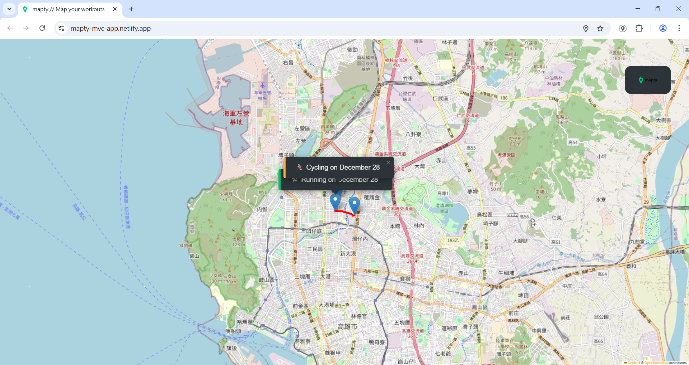
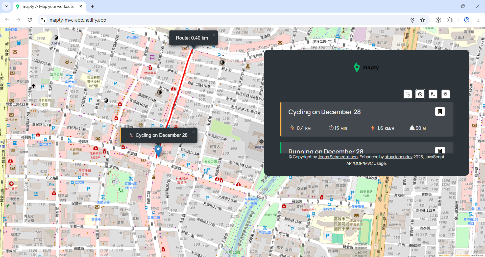

This project is based on the Mapty application from Jonas Schmedtmann's JavaScript course.
I significantly refactored the original implementation to introduce a clear MVC architecture,
focusing on improved state management, separation of concerns, and long-term maintainability.

## Project Overview:

Mapty is a map-based workout tracking application built with Vanilla JavaScript,
designed with a clear separation between application state, UI rendering, and control logic.

## Demo:

https://mapty-mvc-app.netlify.app/

## ScreenShoots:

##### Map View:

##### Add Workout:

## Features:

- Geolocation-based workout creation
- Running & Cycling workout tracking
- Map markers and route rendering
- LocalStorage persistence

## Tech Stack

- Vanilla JavaScript(ES6+)
- Leaflet.js
- HTML / CSS
- LocalStorage API

## Project Structure

- **mapty-model.js**: application state & business logic
- **sub-model/**: domain entities responsible for workout data modeling and calculations
  (Running, Cycling, and shared Workout logic)
- **mapty-controller.js**: event handling & app flow
- **views/**: UI rendering logic
